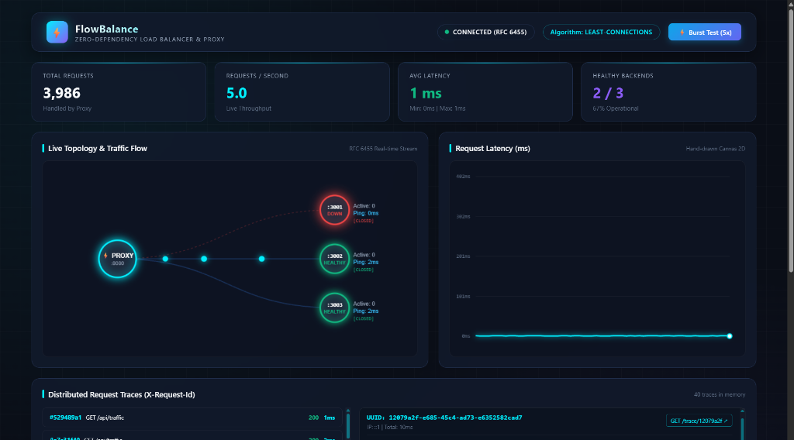

# ⚡ FlowBalance

> **High-Performance, Zero-Dependency Reverse Proxy, Load Balancer & Real-Time Cyberpunk Observability Hub for Node.js.**



---

## 📌 The Core Problem

In modern production architectures, running services on a **single server is a catastrophic single point of failure**:
1. **Unplanned Outages & Crashes**: When a backend server dies or throws unhandled errors, client requests drop immediately, returning hard connection errors to end users.
2. **Traffic Spikes & Cascading Failures**: Sudden bursts of traffic overwhelm single instances, exhausting event loops and causing complete service degradation.
3. **Heavy Dependency Bloat & Supply Chain Vulnerabilities**: Traditional load balancers and observability suites rely on dozens of external npm packages (`express`, `ws`, `http-proxy`, `opossum`, `express-rate-limit`, `jaeger-client`, `chart.js`), introducing security risks, version conflicts, and runtime overhead.

---

## 🚀 The Solution: FlowBalance

**FlowBalance** solves all of these challenges natively. Built from the ground up using **STRICTLY ZERO runtime npm dependencies** — powered entirely by Node.js built-in standard library modules (`http`, `https`, `tls`, `net`, `crypto`, `fs`, `events`, `url`) and native browser APIs (HTML5 Canvas 2D, WebSocket RFC 6455).

### 🌟 Key Capabilities

- 🔄 **Intelligent Load Balancing & Failover**: Dynamically routes traffic across backend clusters using **Round-Robin** or **Least-Connections** algorithms. Buffers in-flight request streams in memory to execute **zero-dropped-request failover retries** if a backend dies mid-flight.
- ⚡ **Hand-Rolled RFC 6455 WebSocket Hub**: Built directly on top of raw `net.Socket` streams — implements SHA-1 + GUID handshake negotiation, binary frame encoding/decoding, bitwise XOR client payload unmasking, and live event broadcasting.
- 🛡️ **Token Bucket Rate Limiter**: High-precision token replenishment engine with configurable RPS and burst capacity. Responds with HTTP `429 Too Many Requests` and standard `Retry-After` headers while auto-pruning stale IP state.
- 🔌 **3-State Circuit Breaker**: Prevents cascading failures with `CLOSED`, `OPEN`, and `HALF_OPEN` state transitions, automatic cooldown timers, and canary probe requests.
- 🔍 **Distributed Request Tracing & Waterfall Visualizer**: Stamps every request with native `crypto.randomUUID()` (`X-Request-Id`), tracking stage offsets and latencies across `received`, `rate_limit_check`, `circuit_check`, `routed`, `backend_response`, and `completed`.
- 📊 **Real-Time Canvas 2D Cyberpunk Dashboard**: 60 FPS visual topology graph with animated request particle physics, smooth bezier latency timeline graphs, live event log stream, and interactive trace waterfall breakdowns.
- 🚦 **Ambient Load Testing Tool**: Native traffic generator with keep-alive HTTP agent connection pooling and live terminal metrics aggregation.

---

## 🏛️ System Architecture

```
                                  +--------------------------------------------------+
                                  |                   Client Request                 |
                                  +--------------------------------------------------+
                                                           |
                                                           v
                                         +------------------------------------+
                                         |     FlowBalance Reverse Proxy      |
                                         |         (Port :8080)               |
                                         +------------------------------------+
                                                           |
                      +------------------------------------+------------------------------------+
                      |                                    |                                    |
                      v                                    v                                    v
     +----------------------------------+ +----------------------------------+ +----------------------------------+
     |     1. Request ID Tracer         | |   2. Token Bucket Rate Limiter   | |    3. Circuit Breaker Manager    |
     |   Generates crypto.randomUUID()  | |   Enforces RPS & Burst Limits    | |   CLOSED -> OPEN -> HALF_OPEN    |
     +----------------------------------+ +----------------------------------+ +----------------------------------+
                      |                                    |                                    |
                      +------------------------------------+------------------------------------+
                                                           |
                                                           v
                                         +------------------------------------+
                                         |     Load Balancer & Dispatch       |
                                         | (Round-Robin / Least-Connections)  |
                                         +------------------------------------+
                                                           |
                            +------------------------------+------------------------------+
                            |                                                             |
                            v                                                             v
             +------------------------------+                              +------------------------------+
             |      Backend Node A (:3001)  |                              |      Backend Node B (:3002)  |
             +------------------------------+                              +------------------------------+
                            |                                                             |
                            +------------------------------+------------------------------+
                                                           |
                                                           v
                                         +------------------------------------+
                                         |  Hand-Rolled RFC 6455 WebSocket    |
                                         |          Broadcaster               |
                                         +------------------------------------+
                                                           |
                                                           v
                                         +------------------------------------+
                                         |            Live  Dashboard         |
                                         |                                    |
                                         +------------------------------------+
```

---

## 📦 Zero-Dependency Proof: Standard Library Mappings

Every single tier of FlowBalance replaces common npm packages with pure Node.js standard library primitives:

| Traditional npm Package | FlowBalance Standard Library Replacement | Implementation Details |
|---|---|---|
| `express` / `fastify` | `http.createServer` / `https.createServer` | Raw `http.IncomingMessage` & `http.ServerResponse` stream routing |
| `ws` / `socket.io` | `net.Socket` + `crypto` | RFC 6455 handshake (SHA-1 + GUID), binary frame buffering, XOR unmasking |
| `http-proxy` / `http-proxy-middleware` | `http.request` | In-memory chunk buffering (`Buffer.concat`) for seamless mid-flight retries |
| `chart.js` / `d3.js` / `echarts` | HTML5 Canvas 2D Context | Custom bezier curves, neon gradient fills, 60 FPS `requestAnimationFrame` |
| `serve-static` | `fs.createReadStream` | Direct filesystem streaming piped into HTTP responses |
| `body-parser` / `raw-body` | Node.js Stream Events | Native `req.on('data')` chunk accumulation |
| `axios` / `node-fetch` | `http.request` | Periodic `/health` probe polling with timeout handling |
| `winston` / `pino` | `console.log` + `JSON.stringify` | Structured JSON log format written directly to `process.stdout` |
| `eventemitter3` | `events.EventEmitter` | Decoupled event-driven pub/sub architecture across subsystems |
| `autocannon` / `artillery` / `k6` | `http.request` + `http.Agent` | Native load generator with keep-alive pooling & terminal reporting |
| `express-rate-limit` | Native `Map` + timestamp deltas | Token bucket replenishment math with automatic stale IP pruning |
| `opossum` / `cockatiel` | State Machine Logic | 3-state Circuit Breaker (`CLOSED`, `OPEN`, `HALF_OPEN`) with cooldowns |
| `jaeger-client` / `uuid` | `crypto.randomUUID()` + `Map` | Ring-buffered request timeline lifecycle tracking & `/trace/:id` endpoint |
| `greenlock` / `tls` | `https` + `tls` | Built-in TLS encryption support with custom key/cert binding |

---

## ⚡ 1-Step Quick Start & Run Guide

FlowBalance includes a **100% UI-Controllable Demo Deck** — you can run the entire demo from the browser without touching multiple terminals!

### 1. Launch FlowBalance Proxy (Auto-Bootstraps Backends)
```bash
node proxy-server.js
```
*(All 3 backend nodes are automatically bootstrapped and managed in the background).*

### 2. Open the Cyberpunk Dashboard
Navigate to **`http://localhost:8080`** in your browser.

---

## 🎬 Zero-Terminal Demo Walkthrough (Perfect for Video Recording)

Everything is controllable right from the top **Control Deck**:

| Control / Action | Under-The-Hood Action | What to Observe on Screen |
|---|---|---|
| **1. `🚀 Start Multi-Traffic`** | Launches parallel asynchronous traffic streams (5, 15, or 30 req/s Turbo) | Glowing neon particle streams flood from Client → Proxy → All 3 Backends. Throughput counter & 60 FPS bezier latency chart spike in real time. |
| **2. `Node 3001` (Kill)** | Terminates Backend Node 3001 child process | Node 3001 turns **RED** on the topology graph. Zero dropped requests — all traffic instantly re-routes to Server B & C. |
| **3. `Node 3001` (Revive)** | Spawns Backend Node 3001 | Health checks detect recovery within 2.5s; Node A turns **GREEN** and resumes receiving balanced traffic. |
| **4. `⚡ Proxy :8080`** | Toggles load-balancing algorithm in memory & broadcasts via WebSocket | Switches between `ROUND-ROBIN` and `LEAST-CONNECTIONS` in real time with instant visual feedback. |
| **5. `⚡ Burst Test (10x)`** | Fires 10 simultaneous requests to exhaust the token bucket | Token bucket exhausts; Event log displays `429 LIMIT — 🛑 Client rate limited` with `Retry-After` seconds. |
| **6. Traces Panel Waterfall** | Click any Request ID in Traces panel | Real-time horizontal waterfall displays exact microsecond timing breakdown across all 6 lifecycle stages. |

---

## 🔌 Circuit Breaker Mechanics: `CLOSED`, `OPEN`, `HALF_OPEN`

FlowBalance implements a hand-rolled 3-state Circuit Breaker state machine (zero npm libraries — replaces `opossum` and `cockatiel`):

```
                  ┌────────────────────────────────────────┐
                  │                                        │
                  ▼                                        │
             ┌──────────┐   5 consecutive failures   ┌──────────┐
             │  CLOSED  │ ─────────────────────────> │   OPEN   │
             │ (Healthy)│                            │ (Tripped)│
             └──────────┘                            └──────────┘
                  ▲                                        │
                  │  Canary probe succeeds                 │ 10s cooldown expires
                  │                                        ▼
                  └────────────────────────────────  ┌───────────┐
                                                     │ HALF_OPEN │ (CB HALF)
                       Canary probe fails (Snap back)│ (Canary)  │
                                                     └───────────┘
```

1. **`CLOSED` (Normal)**: All traffic flows freely. Failure counter stays at `0`.
2. **`OPEN` (Tripped)**: After 5 consecutive failures, the circuit trips. The proxy fails fast immediately and stops sending requests to the dead backend, shielding downstream systems from socket timeout pile-ups.
3. **`HALF_OPEN` (`CB HALF` - Canary Mode)**: When the 10s cooldown expires, the breaker cautiously sends 1-2 probe requests. If the canary probes succeed (200 OK), it resets to **`CLOSED`**; if they fail, it snaps back to **`OPEN`**.

---

## 🌐 Production Cloud Deployment Guide

FlowBalance is 100% production ready and ships with zero runtime npm dependencies (~45MB container footprint).

### Option A: Free Cloud Host (Render / Railway / Heroku)
1. Push repository to GitHub.
2. In [Render.com](https://render.com) or [Railway.app](https://railway.app), click **New Web Service** → Connect your GitHub repo.
3. FlowBalance will automatically detect `render.yaml` or `Procfile`:
   - **Build Command**: *(leave empty)*
   - **Start Command**: `node proxy-server.js`

### Option B: Docker / Docker Compose
```bash
# 1-command build and container launch
docker compose up --build -d
```
Dashboard available at: `http://localhost:8080`

### Option C: Fly.io (Global Edge Deployment)
```bash
fly launch
fly deploy
```

### Option D: Linux VPS / PM2
```bash
pm2 start proxy-server.js --name "flowbalance"
pm2 save
```

---

## ⚙️ Environment Variables Reference

| Variable | Default | Description |
|---|---|---|
| `PORT` | `8080` | Reverse proxy and dashboard listening port |
| `HOST` | `0.0.0.0` | Binding host address (Docker / Cloud container compatible) |
| `BACKENDS` | *Internal (3001, 3002, 3003)* | Comma-separated list of target backend nodes (e.g. `10.0.0.1:3001,10.0.0.2:3002`) |
| `ALGORITHM` | `round-robin` | Routing algorithm (`round-robin` or `least-connections`) |
| `RATE_LIMIT_RPS` | `20` | Token bucket replenishment rate (requests per second per client IP) |
| `RATE_LIMIT_BURST` | `40` | Maximum burst capacity before HTTP 429 is enforced |
| `CB_FAILURE_THRESHOLD`| `5` | Consecutive failures before circuit trips to `OPEN` |
| `CB_COOLDOWN_MS` | `10000` | Cooldown duration before attempting canary `HALF_OPEN` probe |
| `AUTO_START_BACKENDS` | `true` | Auto-start internal managed backend nodes on boot (set `false` for external services) |

---

## 🛠️ Project Structure

```
FlowBalance/
├── proxy-server.js         # Core reverse proxy, HTTP routing, health checks, process manager
├── websocket-server.js      # Hand-rolled RFC 6455 WebSocket server (zero libraries)
├── rate-limiter.js         # Token bucket rate limiting engine with auto-pruning
├── circuit-breaker.js      # 3-state circuit breaker state machine (CLOSED/OPEN/HALF_OPEN)
├── tracer.js               # Distributed request tracer (crypto.randomUUID() + ring buffer)
├── traffic-generator.js    # Native ambient load generator & benchmark tool
├── dashboard.html          # Canvas 2D cyberpunk live monitoring UI & Control Deck
├── dashboard-preview.png   # Dashboard UI preview screenshot
├── Dockerfile              # Production Alpine container image (~45MB)
├── docker-compose.yml      # Multi-container orchestration & healthchecks
├── render.yaml             # Render 1-click cloud blueprint
├── fly.toml                # Fly.io edge deployment manifest
├── Procfile                # Heroku / Railway / Render process manifest
├── package.json            # Node.js manifest & npm scripts (0 runtime dependencies)
├── STDLIB.md               # Standard library replacements & dependency defense proof
└── README.md               # Complete project documentation
```

---

## 👨‍💻 Authors & Hackathon Team

- **Swaraj Prajapati** ([@SwarajPrajapati2006](https://github.com/SwarajPrajapati2006)) — *Advanced Features (Rate Limiting, Circuit Breaker, WebSockets), UI Dashboard & Documentation*
- **Sushant Ravi** ([@Sushant-Ravi14](https://github.com/Sushant-Ravi14)) — *Core Proxy Server Architecture, Load Balancing Algorithms, Health Checks, Traffic Generator & Deployment*

---

